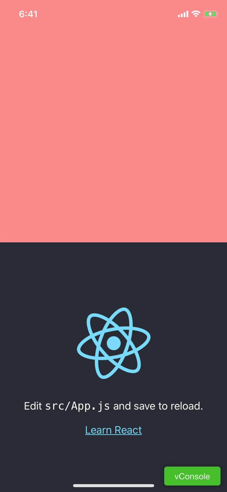

# Hybirds

## Todo:

- [x] set window.isHybird = true
- [x] set window.isIOS = true
- [x] set window.sendNative fn
- [x] change statusBar style
- [x] hidden/show statusBar
- [x] change viewController backgroundColor
- [x] change WKWebview URL from two finger touches 6 times
- [x] change WKWebview URL to save local-data
- [x] set allows backForward navigation gestures
- [x] goBack from JS
- [ ] load app-uuid
- [ ] add ApplePay
- [ ] set WKWebview Keyboard like native
- [ ] push in QRCode and seach callback


## How to use in JS?

Copy hybird.js in your react-project:

```js
// index.js
import hybird from './hybird';
hybird.vconsole(true);
window.onload = hybird.onload(()=>{
  import('./app').then(()=>{
  })
})
```

```js
// app.js
import React from 'react';
import ReactDOM from 'react-dom';
import './index.css';
import App from './Home';
import hybird from './hybird';
ReactDOM.render(<App />, document.getElementById('root'));

hybird.webViewMarge({ full: false, top: 400 });
hybird.statusBarStyle({ style:'light' });
hybird.setBackground({
  hex: 0xff8888,
  alpha: 1,
});
```
Preview like this, webView margin top 600pd, and viewConroller background-color is 0xff8888:

<p align="center">
    
    <p align="center">
        <em>demo</em>
    </p>
</p>


## Licenes

```
MIT License

Copyright (c) 2013-present, Facebook, Inc.

Permission is hereby granted, free of charge, to any person obtaining a copy
of this software and associated documentation files (the "Software"), to deal
in the Software without restriction, including without limitation the rights
to use, copy, modify, merge, publish, distribute, sublicense, and/or sell
copies of the Software, and to permit persons to whom the Software is
furnished to do so, subject to the following conditions:

The above copyright notice and this permission notice shall be included in all
copies or substantial portions of the Software.

THE SOFTWARE IS PROVIDED "AS IS", WITHOUT WARRANTY OF ANY KIND, EXPRESS OR
IMPLIED, INCLUDING BUT NOT LIMITED TO THE WARRANTIES OF MERCHANTABILITY,
FITNESS FOR A PARTICULAR PURPOSE AND NONINFRINGEMENT. IN NO EVENT SHALL THE
AUTHORS OR COPYRIGHT HOLDERS BE LIABLE FOR ANY CLAIM, DAMAGES OR OTHER
LIABILITY, WHETHER IN AN ACTION OF CONTRACT, TORT OR OTHERWISE, ARISING FROM,
OUT OF OR IN CONNECTION WITH THE SOFTWARE OR THE USE OR OTHER DEALINGS IN THE
SOFTWARE.
```
